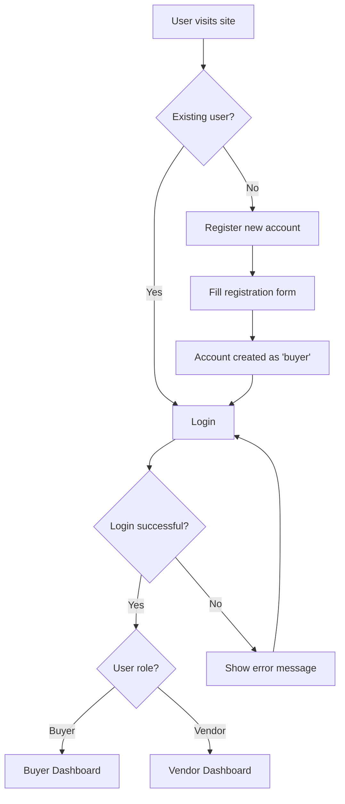
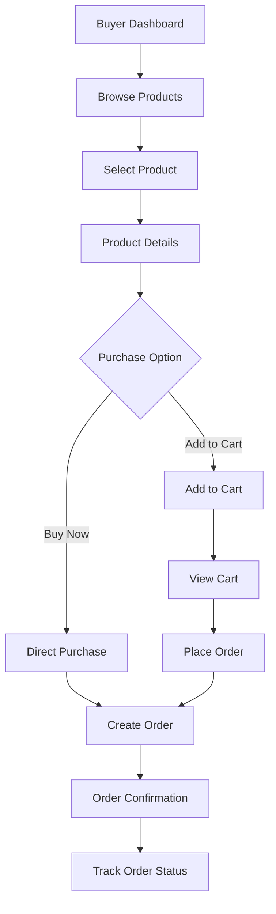
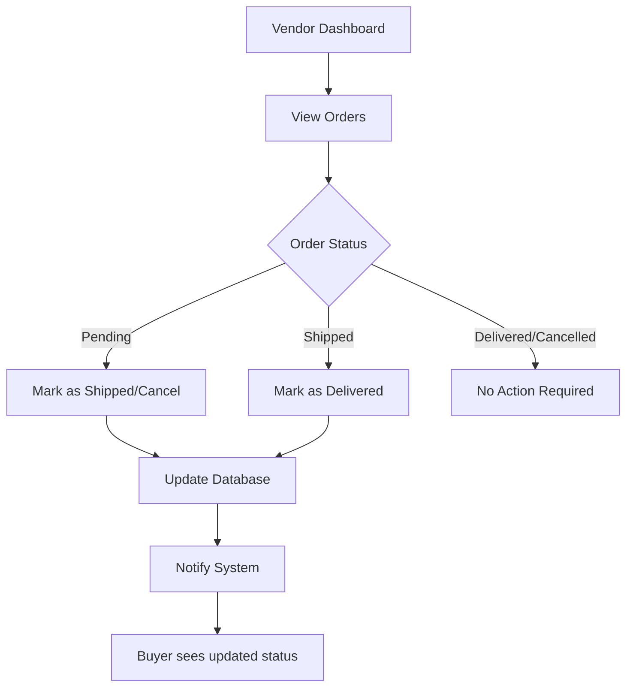
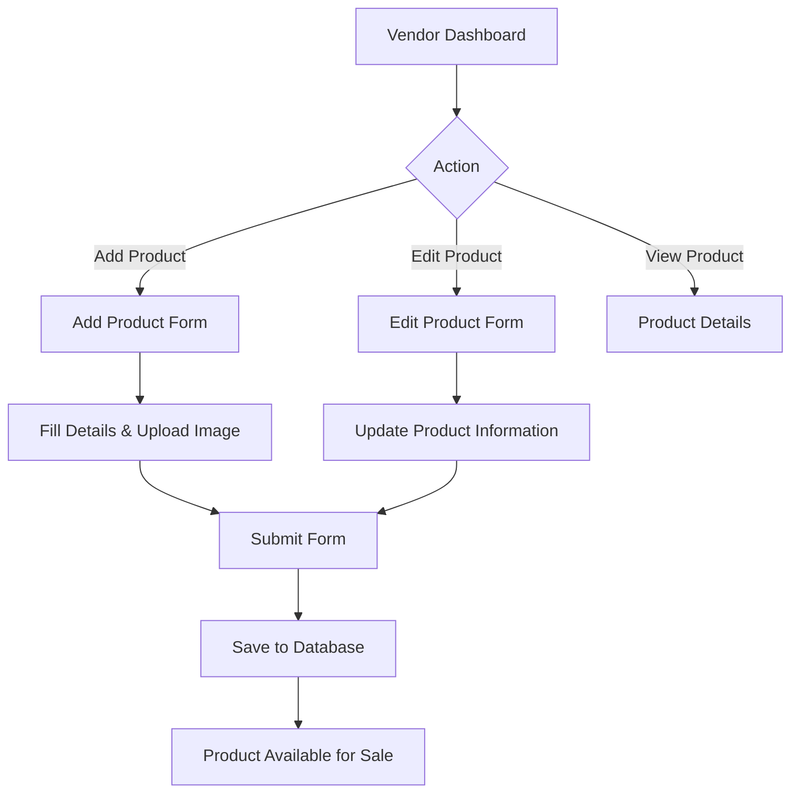

# 🛍️ Kushwaha Store - E-commerce Platform

A comprehensive e-commerce web application built with Flask that supports both buyers and vendors with complete product management, cart functionality, and order processing.

## 📋 Table of Contents
- [Features](#features)
- [Technology Stack](#technology-stack)
- [Project Structure](#project-structure)
- [Installation](#installation)
- [Configuration](#configuration)
- [Database Setup](#database-setup)
- [Usage](#usage)
- [User Manual](#user-manual)
- [API Endpoints](#api-endpoints)
- [System Flow](#system-flow)
- [Screenshots](#screenshots)
- [Contributing](#contributing)
- [License](#license)

## ✨ Features

### 🛒 Buyer Features
- User registration and authentication
- Browse products with detailed information
- Shopping cart functionality
- Quick "Buy Now" option
- Order management and tracking
- Responsive design for mobile and desktop

### 🏪 Vendor Features
- Vendor dashboard with analytics
- Product management (Add/Edit/View products)
- Order management and status updates
- File upload for product images
- Sales statistics and reporting

### 🔧 System Features
- Role-based access control (Buyer/Vendor)
- Secure file uploads
- Flash messaging system
- Responsive CSS design
- SQLite database integration
- Session management

## 💻 Technology Stack

- **Backend**: Python Flask
- **Database**: SQLite
- **Frontend**: HTML5, CSS3, JavaScript
- **Styling**: Custom CSS with responsive design
- **Icons**: Font Awesome
- **File Handling**: Werkzeug utilities
- **Deployment**: Gunicorn (Production ready)

## 📁 Project Structure

```
kushwaha_store/
├── app.py                 # Main Flask application
├── init_db.py            # Database initialization script
├── schema.sql            # Database schema
├── requirements.txt      # Python dependencies
├── Procfile             # Deployment configuration
├── database.db          # SQLite database (auto-generated)
├── static/
│   ├── css/             # Stylesheets for all pages
│   │   ├── home.css
│   │   ├── login.css
│   │   ├── register.css
│   │   ├── buyer_dashboard.css
│   │   ├── vendor_dashboard.css
│   │   ├── products.css
│   │   ├── cart.css
│   │   ├── orders.css
│   │   └── ...
│   └── images/          # Product images and assets
└── templates/           # HTML templates
    ├── home.html
    ├── login.html
    ├── register.html
    ├── buyer_dashboard.html
    ├── vendor_dashboard.html
    ├── products.html
    ├── cart.html
    ├── orders.html
    └── ...
```

## 🚀 Installation

### Prerequisites
- Python 3.7 or higher
- pip (Python package installer)

### Step-by-step Installation

1. **Clone the repository**
   ```bash
   git clone https://github.com/yourusername/kushwaha_store.git
   cd kushwaha_store
   ```

2. **Create a virtual environment**
   ```bash
   python -m venv venv
   
   # On Windows
   venv\Scripts\activate
   
   # On macOS/Linux
   source venv/bin/activate
   ```

3. **Install dependencies**
   ```bash
   pip install -r requirements.txt
   ```

4. **Initialize the database**
   ```bash
   python init_db.py
   ```

5. **Create upload directory**
   ```bash
   mkdir -p static/images
   ```

6. **Run the application**
   ```bash
   python app.py
   ```

7. **Access the application**
   Open your browser and navigate to `http://127.0.0.1:5000`

## ⚙️ Configuration

### Environment Variables
- `SECRET_KEY`: Flask secret key for session management (default: "your_secret_key")
- `UPLOAD_FOLDER`: Directory for uploaded images (default: "static/images")

### Vendor Credentials
The application comes with a pre-configured vendor account:
- **Email**: vendor@kushwahastore.com
- **Password**: vendor123

## 🗄️ Database Setup

The application uses SQLite with the following tables:

### Users Table
- `id`: Primary key
- `name`: User full name
- `email`: Unique email address
- `password`: User password (plain text - consider hashing in production)
- `role`: User role ('buyer' or 'vendor')
- `created_at`: Registration timestamp

### Products Table
- `id`: Primary key
- `vendor_id`: Foreign key to users table
- `name`: Product name
- `description`: Product description
- `price`: Product price
- `image`: Image filename
- `created_at`: Creation timestamp

### Cart Table
- `id`: Primary key
- `buyer_id`: Foreign key to users table
- `product_id`: Foreign key to products table
- `quantity`: Item quantity
- `added_at`: Addition timestamp

### Orders Table
- `id`: Primary key
- `buyer_id`: Foreign key to users table
- `product_id`: Foreign key to products table
- `quantity`: Order quantity
- `total_price`: Total order amount
- `status`: Order status ('pending', 'shipped', 'delivered', 'cancelled')
- `ordered_at`: Order timestamp

## 📖 User Manual

### 🛒 For Buyers

#### Registration and Login
1. **Register**: Navigate to `/register` and fill in your details
2. **Login**: Use your email and password at `/login`

#### Shopping Process
1. **Browse Products**: 
   - View all products on the homepage or `/products`
   - Click on any product for detailed information
   
2. **Add to Cart**:
   - Click "Add to Cart" on product detail page
   - View cart at `/cart`
   - Modify quantities or remove items
   
3. **Place Orders**:
   - **From Cart**: Click "Place Order" to order all cart items
   - **Quick Buy**: Click "Buy Now" for immediate single-item purchase
   
4. **Track Orders**:
   - View all orders at `/orders`
   - Monitor order status (Pending → Shipped → Delivered)

#### Dashboard Features
- View latest products
- Quick access to cart and orders
- Search functionality
- Category browsing

### 🏪 For Vendors

#### Login
Use the pre-configured vendor account or contact admin for vendor access:
- Email: vendor@kushwahastore.com
- Password: vendor123

#### Product Management
1. **Add New Product**:
   - Navigate to `/add_product`
   - Fill in product details (name, description, price)
   - Upload product image (PNG, JPG, JPEG, GIF supported)
   - Submit the form
   
2. **Edit Products**:
   - Go to vendor dashboard
   - Click "Edit" next to any product
   - Update information and save changes
   
3. **View Products**:
   - Dashboard shows all your products
   - Click "View" to see product details

#### Order Management
1. **View Orders**:
   - Navigate to `/view_orders`
   - See all orders for your products
   - View customer details and order information
   
2. **Update Order Status**:
   - **Pending Orders**: Mark as "Shipped" or "Cancel"
   - **Shipped Orders**: Mark as "Delivered"
   - **Delivered/Cancelled**: No further actions needed

#### Dashboard Analytics
- Total products count
- Order statistics by status
- Recent activity overview
- Quick action buttons

## 🛣️ API Endpoints

### Authentication Routes
- `GET/POST /register` - User registration
- `GET/POST /login` - User login
- `GET /logout` - User logout

### Public Routes
- `GET /` - Homepage
- `GET /products` - All products listing
- `GET /product/<id>` - Product details

### Buyer Routes
- `GET /buyer_dashboard` - Buyer dashboard
- `GET /cart` - Shopping cart
- `GET /add_to_cart/<product_id>` - Add item to cart
- `GET /remove_from_cart/<product_id>` - Remove item from cart
- `GET /place_order` - Place order from cart
- `GET /buy_now/<product_id>` - Direct purchase
- `GET /orders` - Order history

### Vendor Routes
- `GET /vendor_dashboard` - Vendor dashboard
- `GET/POST /add_product` - Add new product
- `GET/POST /edit_product/<id>` - Edit product
- `GET /view_orders` - View all orders
- `GET /update_order_status/<order_id>/<status>` - Update order status

## 🔄 System Flow

### User Registration & Authentication Flow


### Shopping Flow (Buyer)


### Order Management Flow (Vendor)


### Product Management Flow (Vendor)


## 🔒 Security Considerations

⚠️ **Important**: This application is designed for educational/development purposes. For production use, consider:

1. **Password Security**: Implement password hashing (bcrypt, scrypt)
2. **Input Validation**: Add comprehensive form validation
3. **File Upload Security**: Validate file types and sizes more strictly
4. **SQL Injection**: Use parameterized queries (already implemented)
5. **Session Security**: Use secure session cookies
6. **HTTPS**: Deploy with SSL/TLS encryption
7. **Environment Variables**: Store sensitive data in environment variables

## 🚀 Deployment

### Local Development
```bash
python app.py
```

### Production (using Gunicorn)
```bash
gunicorn app:app
```

### Environment Variables for Production
```bash
export SECRET_KEY="your-super-secret-key"
export FLASK_ENV="production"
```

## 🤝 Contributing

1. Fork the repository
2. Create a feature branch (`git checkout -b feature/AmazingFeature`)
3. Commit your changes (`git commit -m 'Add some AmazingFeature'`)
4. Push to the branch (`git push origin feature/AmazingFeature`)
5. Open a Pull Request

## 📝 Future Enhancements

- [ ] Payment gateway integration
- [ ] Product reviews and ratings
- [ ] Inventory management
- [ ] Email notifications
- [ ] Advanced search and filtering
- [ ] Vendor analytics dashboard
- [ ] Multi-vendor support
- [ ] Wishlist functionality
- [ ] Product categories
- [ ] Discount and coupon system

## 📞 Support

For support and queries:
- **Phone**: +91 9113777695
- **Email**: support@kushwahastore.com

## 📄 License

This project is licensed under the MIT License - see the [LICENSE](LICENSE) file for details.

## 👏 Acknowledgments

- Flask community for excellent documentation
- Font Awesome for icons
- All contributors and testers

---

**Kushwaha Store** - Your One-Stop Shop for Everything! 🛍️
